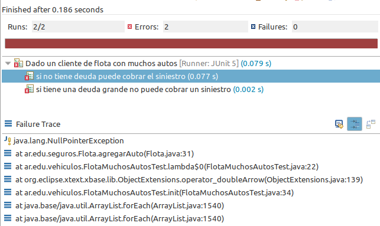

# Ejercicio de Seguros - Metodología para la corrección de errores

 

## Dominio

Un sistema de seguros de automotor define cuándo pagar un siniestro, las condiciones pueden variar:

- para los clientes normales, si no son morosos (la deuda debe ser 0)
- para las flotas de autos, se soporta una deuda de hasta $ 10.000 si el cliente tiene más de 5 vehículos ó hasta $ 5.000 en caso contrario

## Objetivo

Queremos entender diferentes metodologías para corregir errores. 

## To TDD or not to TDD

Si resolvemos el ejercicio mediante la técnica del TDD (Test Driven Development), la primera ventaja que tenemos es que los tests no solo guían nuestra metodología de trabajo, sino que permiten detectar los errores lo más tempranamente posible. Más allá de que usemos TDD a rajatabla o utilicemos un esquema mixto donde alternemos código de negocio / tests, **los tests son nuestra mejor herramienta para detectar errores y garantizar que fueron resueltos**.

## Primeros tests, primeros errores

Escribimos nuestra primera clase de test, concentrándonos en el escenario de la flota con muchos autos. Ejecutamos los tests y...



Primera noción intuitiva: si fallan todos los tests, puede haber un error general (del setup de los tests o más concretamente en la implementación de los objetos de negocio).

### Stack Trace

El stack trace permite recorrer la jerarquía de envío de mensajes directamente donde ocurrió el problema, nos conviene bucear desde el origen del problema hacia atrás:


Ok, sabemos que el problema ocurre cuando queremos agregar un auto a la colección de autos del cliente. Cosas que podrían mejorarse:

- el mensaje de error `NullPointerException` nos da una pista, pero no dice qué referencia está sin inicializar
- al hacer click sobre el primer elemento del stack trace, no se posiciona en la línea donde verdaderamente ocurre el error, que es `autos.add(auto)`

No obstante, por el mensaje de error y por el método donde se ubica, está claro que el problema se origina en el mensaje `add` a la referencia `autos`, que está sin inicializar. Entonces, tenemos nuestro primer problema resuelto:

```xtend
class Flota extends Cliente {
	List<Auto> autos = newArrayList
```

Ejecutamos los tests:


Ya estamos mejor, uno de los test pasa satisfactoriamente.

### Debugging

El segundo test se rompe, volvemos con la técnica de revisar el stack trace:


El test permite darnos información relevante:

- sabemos que la flota tiene muchos autos
- y que tiene una deuda abultada (de $ 15.000)
- entonces no debería poder cobrar el siniestro...
- pero la condición **no** se cumple (falla el assert), porque sí estaría pudiendo cobrar el siniestro

Entonces una segunda opción es debuggear el test, pondremos un **breakpoint** que nos permite pausar el envío de mensajes y analizar el contexto:


Para agregar el breakpoint podemos utilizar el _shortcut_ Ctrl + Shift + B, o bien click sobre el margen izquierdo de la línea. A continuación describimos el proceso que se puede ver en el video:

- ¿por qué definimos el breakpoint en la línea que compara la deuda contra el máximo de deuda? Porque el assert que falla nos lleva al mensaje `puedeCobrarSiniestro()` (F3 o ctrl + click), que tiene justamente esa línea
- luego seleccionamos solamente el test que falla en la ventana JUnit, y con el botón derecho elegimos el comando Debug, que nos sugiere cambiar la perspectiva de Eclipse. Aceptamos, ya que aparecen nuevas ventanas que nos serán muy útiles
- el test se ejecuta hasta el punto en el que tiene que evaluar la expresión `this.deuda < this.montoDeuda`, entonces se detiene la ejecución, se muestra el stack trace hasta donde llegamos y tenemos nosotros el control
- podemos avanzar a la siguiente línea, si la hubiera, con F6, con F5 avanzar hacia adentro (esto provoca que cualquier envío de mensaje nos haga ingresar al método del objeto al que llamamos), o continuar la ejecución normalmente (Resume - F8)


- pero no vamos a avanzar todavía, podemos ver el contexto pasando el mouse sobre las referencias, o bien en la solapa Variables. Allí vemos que la deuda es de $ 15.000 (está correctamente inicializada), entonces tenemos que ver cuál es el monto máximo de la deuda...
- para poder averiguarlo, una opción podría haber sido extraer una variable local en la llamada al método:


eso nos permite visualizar fácilmente los valores, pero nos obliga a tener variables locales (algo que nosotros no te aconsejamos)

- entonces otra opción es ir a la solapa Expressions, y escribir la expresión que queremos evaluar: un detalle interesante es que `this.montoMaximoDeuda` es una expresión válida en Xtend, pero no dentro del contexto del debugger, donde debemos agregar los paréntesis: `this.montoMaximoDeuda()` para que funcione
- y allí finalmente vemos que 15000 < 20000 se cumple, pero resulta que el monto máximo de una flota con muchos autos debería ser $ 10.000

Corregimos nuestro error 

```xtend
	def montoMaximoDeuda() {
		if (autos.size > 5) 10000 else 5000
	}
```

y ahora sí tenemos los dos tests ok.

## Siguiente paso

- Nuestro próximo paso es el branch paso2
